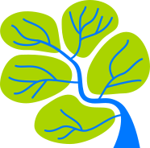

# OpenValleyMap

The open geospatial database of boundaries and the toponymy of all the valleys in the Alps.

## Algorithms

the construction of the boundaries is generated starting from the datasource using some [projects in qgis](jupyter/qgis) and a [jupyter notebook](jupyter) with geospatial libraries in python for optimization

## Tools

the way to contribute to this database is a web tool that allows users to upload the boundaries and toponyms of the small valleys they know

## Datasources

### Openstreetmap

[natural=valley](https://taginfo.openstreetmap.org/tags/natural=valley)

### Digital Terrain Model

[SRTM 90m Digital Elevation Database v4.1](https://cgiarcsi.community/data/srtm-90m-digital-elevation-database-v4-1/)
